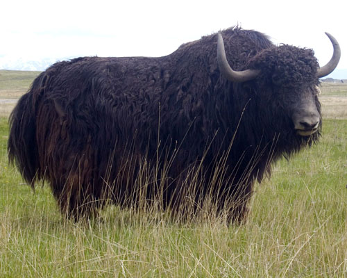

# About YAK

[Wikiedia Yak](https://en.wikipedia.org/wiki/Domestic_yak)
## Fun Yak facts: 
1. Yak is a large animal. Domesticated yaks are smaller than the wild type. On average, wild male yak can reach height of 6.5 feet at the shoulder and weigh of 2200 pounds. Females are three times smaller than males.
2. Yaks have long, bushy tails which are used for the production of fake beards in certain Chinese theaters.
3. Body of yak is covered with thick, wooly coat. It can be brown, black or white in color. Main purpose of the fur is preservation of the body heat and protection against low outer temperatures.
4. Wild yaks have longer fur than domesticated types. Thanks to the fur, wild yaks can survive temperature of -40 degrees of Celsius during the winter. They are also able to swim in the nearly frozen waters without disturbing normal body temperature.
5. Yaks have long, upward curled horns that are located on the each side of the head. Horns in males are two times longer than in females and they can reach 40 inches in length.
6. Yaks are herbivores (plant-eaters). They graze grass, lichens, moss and eat tubers.
7. Just like other cows, yak spends a lot of time in re-chewing its food before final swallowing.
8. During the winter, yaks use their long horns to shovel through the snow in order to find plants located beneath it.
9. Horns are also used for the protection against the predators. Main predators of yaks are Tibetan wolves.
10. Hooves of yaks are split, which facilitate movement across the rocky and icy terrains.
11. Yaks live in herds of 10 to 100 animals that are composed of large number of females and several males.
12. Mating season of yaks takes place during the September. Pregnancy lasts 9 months and ends with one baby. Female gives birth every second year.
13. Mother takes care of the baby until it reaches the age of one year. After that period, young animal will become independent.
14. Although young yak becomes independent early in its life, it will reach the size of adult animal 7 to 8 years after birth.
15. Wild yak can survive up to 20 years in the wild. Domesticated yak can survive few years longer.

## Commonly found in:

* China
* Nepal
* Mongolia
* Russia 

## Different Yak Species
English name | שם בעברית
------------ | -------------
Domestic Yak | יאק הבית
Wild Yak | יאק בר
